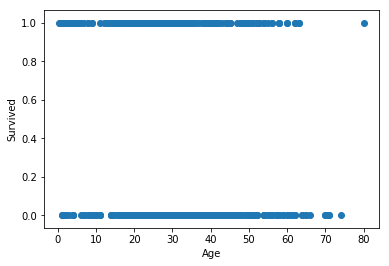
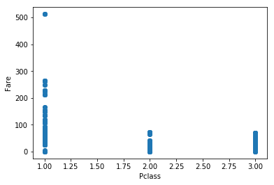
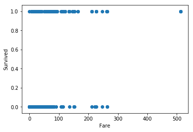
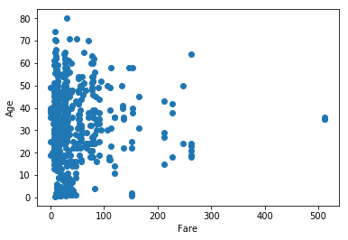
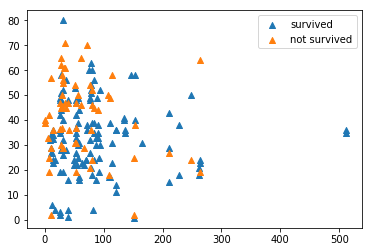
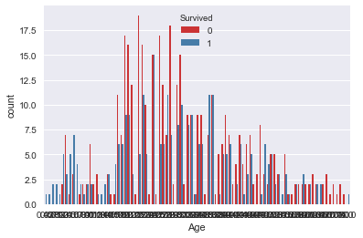
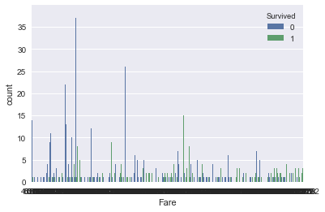
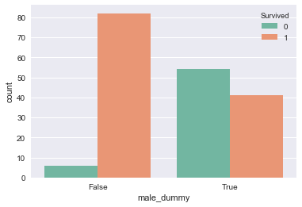

Predicting survival on the Titanic
==================================

In this paper we look at the chances of surviving the Titanic using
python. We predict the chances of an unseen set of data by using
supervised machinelearning on the known dataset.

We use information from `this
site <http://www.encyclopedia-titanica.org>`__.

This is one of the first drafts to get to know the dataset and to
experiment with the python and all the packages included.

Introduction
------------

Preparation
-----------

.. code:: ipython3

    import numpy as np
    import pandas as pd
    import matplotlib.pyplot as plt
    import seaborn as sns

The adventure begins with importing the right packages. The dataset is
downloaded from `kaggle site <https://www.kaggle.com/c/titanic/data>`__
as csv\_file. Next the data is read into a dataframe by using pandas'
pd.read\_csv

.. code:: ipython3

    data = pd.read_csv('titanic.csv')

Here we see the head of our dataframe. A couple of questions come to
mind. Which variables play a role by determining the probability of
surviving the Titanic. Sex and Cabin are not numeric values. How do we
convert these to numeric values?

A first look at the dataset
---------------------------

.. code:: ipython3

    data.head()

.. raw:: html

    

    
    <table border="1" class="dataframe">
      <thead>
        <tr style="text-align: right;">
          <th></th>
          <th>PassengerId</th>
          <th>Survived</th>
          <th>Pclass</th>
          <th>Name</th>
          <th>Sex</th>
          <th>Age</th>
          <th>SibSp</th>
          <th>Parch</th>
          <th>Ticket</th>
          <th>Fare</th>
          <th>Cabin</th>
          <th>Embarked</th>
        </tr>
      </thead>
      <tbody>
        <tr>
          <th>0</th>
          <td>1</td>
          <td>0</td>
          <td>3</td>
          <td>Braund, Mr. Owen Harris</td>
          <td>male</td>
          <td>22.0</td>
          <td>1</td>
          <td>0</td>
          <td>A/5 21171</td>
          <td>7.2500</td>
          <td>NaN</td>
          <td>S</td>
        </tr>
        <tr>
          <th>1</th>
          <td>2</td>
          <td>1</td>
          <td>1</td>
          <td>Cumings, Mrs. John Bradley (Florence Briggs Th...</td>
          <td>female</td>
          <td>38.0</td>
          <td>1</td>
          <td>0</td>
          <td>PC 17599</td>
          <td>71.2833</td>
          <td>C85</td>
          <td>C</td>
        </tr>
        <tr>
          <th>2</th>
          <td>3</td>
          <td>1</td>
          <td>3</td>
          <td>Heikkinen, Miss. Laina</td>
          <td>female</td>
          <td>26.0</td>
          <td>0</td>
          <td>0</td>
          <td>STON/O2. 3101282</td>
          <td>7.9250</td>
          <td>NaN</td>
          <td>S</td>
        </tr>
        <tr>
          <th>3</th>
          <td>4</td>
          <td>1</td>
          <td>1</td>
          <td>Futrelle, Mrs. Jacques Heath (Lily May Peel)</td>
          <td>female</td>
          <td>35.0</td>
          <td>1</td>
          <td>0</td>
          <td>113803</td>
          <td>53.1000</td>
          <td>C123</td>
          <td>S</td>
        </tr>
        <tr>
          <th>4</th>
          <td>5</td>
          <td>0</td>
          <td>3</td>
          <td>Allen, Mr. William Henry</td>
          <td>male</td>
          <td>35.0</td>
          <td>0</td>
          <td>0</td>
          <td>373450</td>
          <td>8.0500</td>
          <td>NaN</td>
          <td>S</td>
        </tr>
      </tbody>
    </table>
    

Here are the summary statistics of the dataframe. The mean,
standarddeviation etc are given in this table.

.. code:: ipython3

    data.describe()

.. raw:: html

    

    
    <table border="1" class="dataframe">
      <thead>
        <tr style="text-align: right;">
          <th></th>
          <th>PassengerId</th>
          <th>Survived</th>
          <th>Pclass</th>
          <th>Age</th>
          <th>SibSp</th>
          <th>Parch</th>
          <th>Fare</th>
        </tr>
      </thead>
      <tbody>
        <tr>
          <th>count</th>
          <td>891.000000</td>
          <td>891.000000</td>
          <td>891.000000</td>
          <td>714.000000</td>
          <td>891.000000</td>
          <td>891.000000</td>
          <td>891.000000</td>
        </tr>
        <tr>
          <th>mean</th>
          <td>446.000000</td>
          <td>0.383838</td>
          <td>2.308642</td>
          <td>29.699118</td>
          <td>0.523008</td>
          <td>0.381594</td>
          <td>32.204208</td>
        </tr>
        <tr>
          <th>std</th>
          <td>257.353842</td>
          <td>0.486592</td>
          <td>0.836071</td>
          <td>14.526497</td>
          <td>1.102743</td>
          <td>0.806057</td>
          <td>49.693429</td>
        </tr>
        <tr>
          <th>min</th>
          <td>1.000000</td>
          <td>0.000000</td>
          <td>1.000000</td>
          <td>0.420000</td>
          <td>0.000000</td>
          <td>0.000000</td>
          <td>0.000000</td>
        </tr>
        <tr>
          <th>25%</th>
          <td>223.500000</td>
          <td>0.000000</td>
          <td>2.000000</td>
          <td>20.125000</td>
          <td>0.000000</td>
          <td>0.000000</td>
          <td>7.910400</td>
        </tr>
        <tr>
          <th>50%</th>
          <td>446.000000</td>
          <td>0.000000</td>
          <td>3.000000</td>
          <td>28.000000</td>
          <td>0.000000</td>
          <td>0.000000</td>
          <td>14.454200</td>
        </tr>
        <tr>
          <th>75%</th>
          <td>668.500000</td>
          <td>1.000000</td>
          <td>3.000000</td>
          <td>38.000000</td>
          <td>1.000000</td>
          <td>0.000000</td>
          <td>31.000000</td>
        </tr>
        <tr>
          <th>max</th>
          <td>891.000000</td>
          <td>1.000000</td>
          <td>3.000000</td>
          <td>80.000000</td>
          <td>8.000000</td>
          <td>6.000000</td>
          <td>512.329200</td>
        </tr>
      </tbody>
    </table>
    

It is possible to search for particular passenger in the dataset. Such
as passengers who were older than eighty years.

.. code:: ipython3

    data[data.Age == 80]

.. raw:: html

    

    
    <table border="1" class="dataframe">
      <thead>
        <tr style="text-align: right;">
          <th></th>
          <th>PassengerId</th>
          <th>Survived</th>
          <th>Pclass</th>
          <th>Name</th>
          <th>Sex</th>
          <th>Age</th>
          <th>SibSp</th>
          <th>Parch</th>
          <th>Ticket</th>
          <th>Fare</th>
          <th>Cabin</th>
          <th>Embarked</th>
        </tr>
      </thead>
      <tbody>
        <tr>
          <th>630</th>
          <td>631</td>
          <td>1</td>
          <td>1</td>
          <td>Barkworth, Mr. Algernon Henry Wilson</td>
          <td>male</td>
          <td>80.0</td>
          <td>0</td>
          <td>0</td>
          <td>27042</td>
          <td>30.0</td>
          <td>A23</td>
          <td>S</td>
        </tr>
      </tbody>
    </table>
    

First figures
-------------

To get a good impression of the dataset and the influence of the
variables, a couple of diagrams are made using ``mathplotlib``.

.. code:: ipython3

    plt.scatter(data.Age,data.Survived)
    plt.xlabel('Age')
    plt.ylabel('Survived')

.. parsed-literal::

    Text(0,0.5,'Survived')

Scatterplots are not always the best choice to illustrate some of the
variables. There is not much to say about the variance because of the
fact that a lot of points are close to eachother. A couple of values
however stand out. We see that a passenger or more passengers travelling
first class have paid more than 500 pounds for their ticketprice.

.. code:: ipython3

    plt.scatter(data.Pclass,data.Fare)
    plt.xlabel('Pclass')
    plt.ylabel('Fare')

.. parsed-literal::

    Text(0,0.5,'Fare')

.. code:: ipython3

    plt.scatter(data.Fare, data.Survived)
    plt.xlabel('Fare')
    plt.ylabel('Survived')

.. parsed-literal::

    Text(0,0.5,'Survived')

.. code:: ipython3

    plt.scatter(data.Fare, data.Age)
    plt.xlabel('Fare')
    plt.ylabel('Age')

.. parsed-literal::

    Text(0,0.5,'Age')

I was curious to see who had paid more than 400 pounds for their ticket.
We see that it is easy to make a selection in our dataset using the
``>`` sign

.. code:: ipython3

    data[data.Fare > 400]

.. raw:: html

    

    
    <table border="1" class="dataframe">
      <thead>
        <tr style="text-align: right;">
          <th></th>
          <th>PassengerId</th>
          <th>Survived</th>
          <th>Pclass</th>
          <th>Name</th>
          <th>Sex</th>
          <th>Age</th>
          <th>SibSp</th>
          <th>Parch</th>
          <th>Ticket</th>
          <th>Fare</th>
          <th>Cabin</th>
          <th>Embarked</th>
        </tr>
      </thead>
      <tbody>
        <tr>
          <th>258</th>
          <td>259</td>
          <td>1</td>
          <td>1</td>
          <td>Ward, Miss. Anna</td>
          <td>female</td>
          <td>35.0</td>
          <td>0</td>
          <td>0</td>
          <td>PC 17755</td>
          <td>512.3292</td>
          <td>NaN</td>
          <td>C</td>
        </tr>
        <tr>
          <th>679</th>
          <td>680</td>
          <td>1</td>
          <td>1</td>
          <td>Cardeza, Mr. Thomas Drake Martinez</td>
          <td>male</td>
          <td>36.0</td>
          <td>0</td>
          <td>1</td>
          <td>PC 17755</td>
          <td>512.3292</td>
          <td>B51 B53 B55</td>
          <td>C</td>
        </tr>
        <tr>
          <th>737</th>
          <td>738</td>
          <td>1</td>
          <td>1</td>
          <td>Lesurer, Mr. Gustave J</td>
          <td>male</td>
          <td>35.0</td>
          <td>0</td>
          <td>0</td>
          <td>PC 17755</td>
          <td>512.3292</td>
          <td>B101</td>
          <td>C</td>
        </tr>
      </tbody>
    </table>
    

.. code:: ipython3

    df_cleaned = data.dropna()
    df_cleaned['male_dummy'] = (df_cleaned.Sex == 'male') #nieuwe kolom definiëren om male te veranderen in een boolean
    X = df_cleaned[['Age','male_dummy', 'Pclass', 'SibSp', 'Fare']]
    y = df_cleaned[['Survived']]

.. parsed-literal::

    /Users/myrthe/anaconda3/lib/python3.6/site-packages/ipykernel_launcher.py:2: SettingWithCopyWarning: 
    A value is trying to be set on a copy of a slice from a DataFrame.
    Try using .loc[row_indexer,col_indexer] = value instead
    
    See the caveats in the documentation: http://pandas.pydata.org/pandas-docs/stable/indexing.html#indexing-view-versus-copy
      

Here we see that we clean our dataset for the first time to make it more
suitable for the packages we will be using. All rows with missing values
(these are called NaNs, short for Not a Number) are deleted for
scikit\_learn can't work with NaNs by using ``.dropna()``. There are
other ways than deleting rows to handle this problem. Replace the NaNs
with the mean or to interpolate for example. However the choice was made
to delete these rows. Furthermore we see that the problem of the ``Sex``
column not being a numeric value is handled. The values in the ``Sex``
column are changed into a boolean. Males are given a ``True`` and the
females are given a ``False``. Next a couple of variables have added to
``X``. ``Age``,\ ``male_dummy``, ``Pclass``, ``SibSp``, ``Fare`` are all
numeric values and therefore easy to use.

Here we see the cleaned dataframe with the new added column
``male_dummy``

.. code:: ipython3

    df_cleaned.head()

.. raw:: html

    

    
    <table border="1" class="dataframe">
      <thead>
        <tr style="text-align: right;">
          <th></th>
          <th>PassengerId</th>
          <th>Survived</th>
          <th>Pclass</th>
          <th>Name</th>
          <th>Sex</th>
          <th>Age</th>
          <th>SibSp</th>
          <th>Parch</th>
          <th>Ticket</th>
          <th>Fare</th>
          <th>Cabin</th>
          <th>Embarked</th>
          <th>male_dummy</th>
        </tr>
      </thead>
      <tbody>
        <tr>
          <th>1</th>
          <td>2</td>
          <td>1</td>
          <td>1</td>
          <td>Cumings, Mrs. John Bradley (Florence Briggs Th...</td>
          <td>female</td>
          <td>38.0</td>
          <td>1</td>
          <td>0</td>
          <td>PC 17599</td>
          <td>71.2833</td>
          <td>C85</td>
          <td>C</td>
          <td>False</td>
        </tr>
        <tr>
          <th>3</th>
          <td>4</td>
          <td>1</td>
          <td>1</td>
          <td>Futrelle, Mrs. Jacques Heath (Lily May Peel)</td>
          <td>female</td>
          <td>35.0</td>
          <td>1</td>
          <td>0</td>
          <td>113803</td>
          <td>53.1000</td>
          <td>C123</td>
          <td>S</td>
          <td>False</td>
        </tr>
        <tr>
          <th>6</th>
          <td>7</td>
          <td>0</td>
          <td>1</td>
          <td>McCarthy, Mr. Timothy J</td>
          <td>male</td>
          <td>54.0</td>
          <td>0</td>
          <td>0</td>
          <td>17463</td>
          <td>51.8625</td>
          <td>E46</td>
          <td>S</td>
          <td>True</td>
        </tr>
        <tr>
          <th>10</th>
          <td>11</td>
          <td>1</td>
          <td>3</td>
          <td>Sandstrom, Miss. Marguerite Rut</td>
          <td>female</td>
          <td>4.0</td>
          <td>1</td>
          <td>1</td>
          <td>PP 9549</td>
          <td>16.7000</td>
          <td>G6</td>
          <td>S</td>
          <td>False</td>
        </tr>
        <tr>
          <th>11</th>
          <td>12</td>
          <td>1</td>
          <td>1</td>
          <td>Bonnell, Miss. Elizabeth</td>
          <td>female</td>
          <td>58.0</td>
          <td>0</td>
          <td>0</td>
          <td>113783</td>
          <td>26.5500</td>
          <td>C103</td>
          <td>S</td>
          <td>False</td>
        </tr>
      </tbody>
    </table>
    

.. code:: ipython3

    from sklearn.linear_model import LogisticRegression
    logreg = LogisticRegression()
    logreg.fit(X, y)
    y_pred = logreg.predict(X)

.. parsed-literal::

    /Users/myrthe/anaconda3/lib/python3.6/site-packages/sklearn/utils/validation.py:578: DataConversionWarning: A column-vector y was passed when a 1d array was expected. Please change the shape of y to (n_samples, ), for example using ravel().
      y = column_or_1d(y, warn=True)

Here we initialize the first regression called logistic regression. We
don't split our dataframe in test and training set yet. For a general
indication we only use the regressor and fit it on the cleaned dataset.
After that we predict on the same dataset.

.. code:: ipython3

    logreg.coef_

.. parsed-literal::

    array([[-0.01636209, -2.08109476,  0.01318695,  0.2035389 ,  0.00296447]])

Here we see the outcome of our first try with the logistic regression.

To interpret these coefficients, let's look at the order of the columns
in ``X``:

.. code:: ipython3

    X.head()

.. raw:: html

    

    
    <table border="1" class="dataframe">
      <thead>
        <tr style="text-align: right;">
          <th></th>
          <th>Age</th>
          <th>male_dummy</th>
          <th>Pclass</th>
          <th>SibSp</th>
          <th>Fare</th>
        </tr>
      </thead>
      <tbody>
        <tr>
          <th>1</th>
          <td>38.0</td>
          <td>False</td>
          <td>1</td>
          <td>1</td>
          <td>71.2833</td>
        </tr>
        <tr>
          <th>3</th>
          <td>35.0</td>
          <td>False</td>
          <td>1</td>
          <td>1</td>
          <td>53.1000</td>
        </tr>
        <tr>
          <th>6</th>
          <td>54.0</td>
          <td>True</td>
          <td>1</td>
          <td>0</td>
          <td>51.8625</td>
        </tr>
        <tr>
          <th>10</th>
          <td>4.0</td>
          <td>False</td>
          <td>3</td>
          <td>1</td>
          <td>16.7000</td>
        </tr>
        <tr>
          <th>11</th>
          <td>58.0</td>
          <td>False</td>
          <td>1</td>
          <td>0</td>
          <td>26.5500</td>
        </tr>
      </tbody>
    </table>
    

Graphic illustration of a prediction
------------------------------------

One of the first graphic illustrations of the relation between fare, age
and survival. The relation is not very clear but we see that the higher
the fare the more people survived and the higher the age the less people
survived. However, this figure is not very accurate, because of the fact
that only three variables were used.

.. code:: ipython3

    survived = df_cleaned[df_cleaned.Survived == 1]
    not_survived = df_cleaned[df_cleaned.Survived == 0]
    
    plt.scatter(survived.Fare, survived.Age, marker='^', label = 'survived')
    plt.scatter(not_survived.Fare, not_survived.Age, marker='^', label = 'not survived')
    plt.legend()

.. parsed-literal::

    <matplotlib.legend.Legend at 0x1a1f05ec50>

.. code:: ipython3

    P = df_cleaned[['Pclass', 'Fare','Age','male_dummy']]

We select from our df\_cleaned only the columns with numeric values.
This is convenient for the splitting into train and testsets, for
scikit\_learn can only work with numbers. Difference between P and X
here is that X also has the column siblings, whereas P only has four
columns

.. code:: ipython3

    P.head()

.. raw:: html

    

    
    <table border="1" class="dataframe">
      <thead>
        <tr style="text-align: right;">
          <th></th>
          <th>Pclass</th>
          <th>Fare</th>
          <th>Age</th>
          <th>male_dummy</th>
        </tr>
      </thead>
      <tbody>
        <tr>
          <th>1</th>
          <td>1</td>
          <td>71.2833</td>
          <td>38.0</td>
          <td>False</td>
        </tr>
        <tr>
          <th>3</th>
          <td>1</td>
          <td>53.1000</td>
          <td>35.0</td>
          <td>False</td>
        </tr>
        <tr>
          <th>6</th>
          <td>1</td>
          <td>51.8625</td>
          <td>54.0</td>
          <td>True</td>
        </tr>
        <tr>
          <th>10</th>
          <td>3</td>
          <td>16.7000</td>
          <td>4.0</td>
          <td>False</td>
        </tr>
        <tr>
          <th>11</th>
          <td>1</td>
          <td>26.5500</td>
          <td>58.0</td>
          <td>False</td>
        </tr>
      </tbody>
    </table>
    

.. code:: ipython3

    from sklearn.linear_model import LogisticRegression
    logreg = LogisticRegression(fit_intercept=True)
    logreg.fit(P, y)
    y_pred = logreg.predict(P)

.. parsed-literal::

    /Users/myrthe/anaconda3/lib/python3.6/site-packages/sklearn/utils/validation.py:578: DataConversionWarning: A column-vector y was passed when a 1d array was expected. Please change the shape of y to (n_samples, ), for example using ravel().
      y = column_or_1d(y, warn=True)

We fit our regressor on our dataset and predict on that same dataset.
Once again without splitting into train and testset. Just to get a
general idea about the values of the coeffecients.

.. code:: ipython3

    logreg.coef_

.. parsed-literal::

    array([[ 0.00917324,  0.00337838, -0.01693475, -2.07643966]])

One could interpret the found coeffecients as follows: The coeffecients
for class and fare are positive, which may indicate that the higher the
class and price paid for a ticket, the higher the chance of surviving
the Titanic. When we look at age and sex we see the exact opposite for
the coeffecients are negative. The higher the age the lower your chances
and if you were a man on board of the titanic your chances of surviving
were lower.

.. code:: ipython3

    from sklearn.neighbors import KNeighborsClassifier

Another regression is used in the following lines. (explanation K
nearest neighbours)

.. code:: ipython3

    knn = KNeighborsClassifier(n_neighbors=6)

.. code:: ipython3

    knn.fit(P,y)

.. parsed-literal::

    /Users/myrthe/anaconda3/lib/python3.6/site-packages/ipykernel_launcher.py:1: DataConversionWarning: A column-vector y was passed when a 1d array was expected. Please change the shape of y to (n_samples, ), for example using ravel().
      """Entry point for launching an IPython kernel.

.. parsed-literal::

    KNeighborsClassifier(algorithm='auto', leaf_size=30, metric='minkowski',
               metric_params=None, n_jobs=1, n_neighbors=6, p=2,
               weights='uniform')

.. code:: ipython3

    prediction = knn.predict(P)

.. code:: ipython3

    P.shape

.. parsed-literal::

    (183, 4)

.. code:: ipython3

    print('Prediction{}'.format(prediction))

.. parsed-literal::

    Prediction[1 0 0 1 0 1 1 1 1 0 0 1 1 1 1 0 1 1 1 1 1 1 1 1 1 1 1 0 0 1 1 1 0 1 1 1 1
     1 1 1 1 1 1 0 1 1 0 1 1 1 1 1 1 1 1 1 1 1 1 1 1 1 1 1 1 0 1 1 1 0 1 1 1 1
     1 1 1 1 1 1 1 1 1 1 1 1 1 1 0 1 0 0 1 0 1 1 1 0 0 1 1 1 1 1 0 1 1 1 0 1 1
     0 1 0 0 0 1 1 1 0 1 1 1 1 1 1 1 0 1 0 0 1 1 0 0 0 1 1 1 1 1 0 0 1 1 0 1 1
     1 1 1 1 1 1 1 1 0 1 1 1 1 1 0 1 1 1 0 1 1 0 0 0 1 1 1 1 1 1 1 0 1 1 1]

Here we see one of our first predictions. 1 indicates the passenger has
survived and 0 indicates that the passenger has died

Elke persoon heeft andere karakteristieken, dus dit zijn voorspellingen
per persoon. Dus er komt een kans uit en dan kijkt de regressor, boven
of onder 0.5

.. code:: ipython3

    knn.score(P,y)

.. parsed-literal::

    0.7486338797814208

This score gives a number between 0 and 1 and gives an impression of the
accuracy of our model. However, this accuracy is not an indication of
how well our model performs (explanation spam mail etc.)

.. code:: ipython3

    P.head()

.. raw:: html

    

    
    <table border="1" class="dataframe">
      <thead>
        <tr style="text-align: right;">
          <th></th>
          <th>Pclass</th>
          <th>Fare</th>
          <th>Age</th>
          <th>male_dummy</th>
        </tr>
      </thead>
      <tbody>
        <tr>
          <th>1</th>
          <td>1</td>
          <td>71.2833</td>
          <td>38.0</td>
          <td>False</td>
        </tr>
        <tr>
          <th>3</th>
          <td>1</td>
          <td>53.1000</td>
          <td>35.0</td>
          <td>False</td>
        </tr>
        <tr>
          <th>6</th>
          <td>1</td>
          <td>51.8625</td>
          <td>54.0</td>
          <td>True</td>
        </tr>
        <tr>
          <th>10</th>
          <td>3</td>
          <td>16.7000</td>
          <td>4.0</td>
          <td>False</td>
        </tr>
        <tr>
          <th>11</th>
          <td>1</td>
          <td>26.5500</td>
          <td>58.0</td>
          <td>False</td>
        </tr>
      </tbody>
    </table>
    

.. code:: ipython3

    q = df_cleaned.Survived

.. code:: ipython3

    q.head()

.. parsed-literal::

    1     1
    3     1
    6     0
    10    1
    11    1
    Name: Survived, dtype: int64

.. code:: ipython3

    from sklearn.linear_model import LogisticRegression

.. code:: ipython3

    from sklearn.model_selection import train_test_split

.. code:: ipython3

    logreg = LogisticRegression()
    P_train, P_test, q_train, q_test = train_test_split(P,q, test_size=0.2, random_state=42)
    logreg.fit(P_train, q_train)
    q_pred = logreg.predict(P_test)

Here we see the dataset being split into a test and a training set. The
arguments give us information about how much of our data we use as a
test\_set and how much of our data we use as a training\_set. This and
the parameters will be varied to see which parameter gives the best
prediction. We fit our regressor on the training\_set and predict on the
test\_set.

.. code:: ipython3

    print('Prediction {}'.format(q_pred))

.. parsed-literal::

    Prediction [1 1 1 0 0 0 1 1 1 0 0 1 0 1 0 0 1 0 0 1 1 1 0 1 0 1 1 0 1 1 1 1 0 1 1 1 1]

.. code:: ipython3

    P_train.head()

.. raw:: html

    

    
    <table border="1" class="dataframe">
      <thead>
        <tr style="text-align: right;">
          <th></th>
          <th>Pclass</th>
          <th>Fare</th>
          <th>Age</th>
          <th>male_dummy</th>
        </tr>
      </thead>
      <tbody>
        <tr>
          <th>331</th>
          <td>1</td>
          <td>28.5000</td>
          <td>45.5</td>
          <td>True</td>
        </tr>
        <tr>
          <th>336</th>
          <td>1</td>
          <td>66.6000</td>
          <td>29.0</td>
          <td>True</td>
        </tr>
        <tr>
          <th>193</th>
          <td>2</td>
          <td>26.0000</td>
          <td>3.0</td>
          <td>True</td>
        </tr>
        <tr>
          <th>75</th>
          <td>3</td>
          <td>7.6500</td>
          <td>25.0</td>
          <td>True</td>
        </tr>
        <tr>
          <th>248</th>
          <td>1</td>
          <td>52.5542</td>
          <td>37.0</td>
          <td>True</td>
        </tr>
      </tbody>
    </table>
    

.. code:: ipython3

    from sklearn.metrics import roc_auc_score
    q_pred_prob = logreg.predict_proba(P_test)[:,1]
    roc_auc_score(q_test, q_pred_prob)

.. parsed-literal::

    0.8416149068322981

When the test\_size is changed from 0.4 to 0.2 , the score increases
with more than 10%. This makes sense because a smaller test\_set gives a
higher accuracy score.

.. code:: ipython3

    from sklearn.model_selection import cross_val_score
    cv_scores = cross_val_score(logreg, P, q, cv=5, scoring='roc_auc')
    print(cv_scores)

.. parsed-literal::

    [0.86666667 0.80333333 0.74666667 0.73263889 0.92361111]

.. code:: ipython3

    len(P)

.. parsed-literal::

    183

.. code:: ipython3

    len(prediction)

.. parsed-literal::

    183

Seaborn countplot option? plt.figure()

sns.countplot(x='education', hue='party', data=df, palette='RdBu')

plt.xticks([0,1], ['No', 'Yes']) plt.show()

Given all the variables (age, gender, place of boarding etc.), you make
a linear function (a1x1+a2x2+anxn+b). Computer puts this in the logistic
function for x. For a particular x, you get a value between zero and
one. This is your chance of survival. Boundary is 0,5. X < 0,5 passenger
didn't survive. Computer tries to plot a logistic function where R2 is
as small as possible. This is called the fitting process. The logistic
function has to be as close to the datapoints as possible.

.. code:: ipython3

    sns.countplot?

.. code:: ipython3

    sns.set(style="darkgrid")
    ax = sns.countplot(x="Pclass",hue="Survived", data=data, palette="Set3")

.. image:: output_64_0.png

More people in class 3 than in class 1, makes it difficult to compare
and draw a conclusion. Percentage? In general, we cannot draw a
conclusion regarding survival probabilities because there were more
people in class 3 than in one 1. In the third class, more passengers
died than survived. In the first class, more people survived than
perished. We cannot compare the results from the first class to the
third class. The plot only shows us one variable. This is another reason
why we cannot be sure about the influence of class on the chance of
survival. *Simpson paradox*

.. code:: ipython3

    sns.set(style="darkgrid")
    ax = sns.countplot(x="Age",hue="Survived", data=data, palette="Set1")

.. code:: ipython3

    sns.set(style="darkgrid")
    ax = sns.countplot(x="Fare",hue="Survived", data=data)

.. code:: ipython3

    sns.set(style="darkgrid")
    ax = sns.countplot(x="male_dummy",hue="Survived", data=df_cleaned, palette="Set2")

